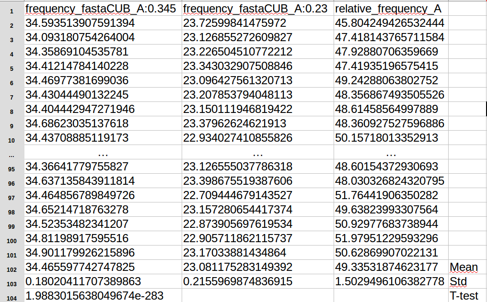

Random fasta comparater's documentation
=======================================

Prerequisites
--------------

**Before launching anything a file named** ``src/config.py`` **with the following content must be created :**

.. code-block:: python

  #!/usr/bin/env  python3

  path = "../fasta_generator/src"

  fgdfre = "%s/fasta_generator_dinucleotide_from_real_exon.py" % path
  fg = "%s/fasta_generator.py" % path
  fgfre = "%s/fasta_generator_from_real_exons.py" % path
  frg = "%s/fasta_reverse_generator.py" % path
  fg2fre = "%s/fasta_generator_2features_real_exons_.py" % path

Where ``../fasta_generator/src`` corresponds to the folder containing the scripts ``fasta_generator_dinucleotide_from_real_exon.py``,  ``fasta_generator.py``, ``fasta_generator_from_real_exons.py``, ``fasta_reverse_generator.py`` and ``fasta_generator_2features_real_exons_.py``. If you've moved those scripts in another folder you can change the ``path``.
You must also read the README located in ``../fasta_generator`` to be able to lanch the scripts in the directory ``../fasta_generator/src``

This program uses `python <https://www.python.org>`_ version ``3.5`` and this following dependencies:
  * `os <https://docs.python.org/2/library/os.html>`_ : to test whether a file or a dir exist and to create dir
  * `argparse <https://pypi.python.org/pypi/argparse>`_ : for parser creation
  * `subprocess <https://docs.python.org/2/library/subprocess.html>`_ : to spawn new process
  * `Biopython <http://biopython.org/>`_ : to read fasta file
  * `sys <https://docs.python.org/2/library/sys.html>`_
  * `numpy <http://www.numpy.org/>`_

Description of the script `random_fasta_comparsion_high_N_low.py`
-----------------------------------------------------------------

The goal of this script is to:
 1. Generate a couple of fasta files:

  * One fasta file contains random sequences enriched in a particular unit :math:`F` (*nucleotide*, *di-nucleotide* or *amino acid physicochemical properties*)
  * The other fasta file contains random sequences impoverished for this same unit :math:`F`.

 2. Then , it computes for each fasta files, their content for the enriched or impoverished unit :math:`F`. It also compute the relative frequency for this unit :math:`F` between the two fasta files generated (calculation explained after).
 3. Finally,  it computes for each fasta file, their content for another interest unit :math:`U`. It also compute the relative frequency for this unit :math:`U` between the two fasta files generated (calculation explained after).
 4. The steps 1-3 are repeated a number :math:`X` of time and every value computed at step 2 and 3 are reported in a summary file.
 5. When this process is finished we calculate the mean and the standard deviation of:

  * The average and the standard deviation of the frequencies and the relative frequencies of :math:`F` and  :math:`U` in the :math:`X` impoverished and enriched fasta files generated are computed

The relative frequency is calculated as follow:

.. math::

  F_{relative} = \frac{F_{1} - F_{2}}{F_{2}} \times 100

Where:
  * :math:`F_{relative}` is the relative frequency of a unit :math:`F`
  * :math:`F_{1}` is the average frequency of :math:`F` of every sequence in a fasta file '1'
  * :math:`F_{2}` is the average frequency of :math:`F` of every sequence in a fasta file '2'

The fasta files can be generated in two different ways:
  1. CUB sequences corresponds to generated sequences having the same codon biais usage than the one present in fasterDB control exons (CCE exons). Then those sequences are enriched or impoverished for the unit :math:`F` by mutating every sequences, one unit at a time.
  2. MUT sequences corresponds to exon sequences selected randomly from FasterDB and then mutated, one unit at a time, to increase or deacrease the frequency of a given unit :math:`F`.

Example
#######

For example if we want to generate 100 couples of fasta files having:
  * A high content of **A** nucleotide : :math:`freq_{high}(A)=0.345`
  * A low content of **A** nucleotide : :math:`freq_{low}(A)=0.24`

And checking for their content in hydrophilic and hydrophobic encoded amino acids, we must execute this command line :

.. code-block:: bash

  python3 src/random_fasta_comparsion_high_N_low.py --type_unit nt --unit A --freq_high 0.345 --freq_low 0.23 --output result/ --iteration 100 --iscub True --type_unit_interest feature,feature --unit_interest Hydrophilic#1,Hydrophobic#1

This will create a file in the ``result/`` folder named : ``feature,feature_Hydrophilic#1,Hydrophobic#1_frequency_comparison_between_100_CUB_fasta_file-high_A:0.345_low_A:0.23.tsv``
The content of this file is displayed below:

  Content of the result file

.. note::

  1. The 2 lines before the last one, corresponds to the mean and the standart deviation of each column.
  2. The last line corresponds to the p-value of a t-test made on the average frequencies of Adenine between the 100 enriched and impoverished fasta files in Adenine (values in columns 1 and 2 without the 3 last lines).
  3. The first column (exept the 3 last lines) corresponds to the mean frequency of sequences in each fasta file having an high content of **A** (:math:`freq_{high}(A)=0.345`)
  4. The second column (exept the 3 last lines) corresponds to the mean frequency of sequences in fasta file having an low content of **A** (:math:`freq_{low}(A)=0.24`)
  5. The third and last column (exept the 2 last lines) correspond the relative frequency of **A**:  :math:`F_{relative_A} = \frac{F_{high_A} - F_{low_A}}{F_{low_A}}`
  6. There is 6 other columns (not shown) that are exaclty the same as the 3 first but for hydrophilic, and hydrophobic average frequencies in the 100 enriched and impoveriched fasta files in Adenine.

Description of the script `src/random_fasta_dependant_feature_high_N_low.py`
----------------------------------------------------------------------------

The script ``src/random_fasta_dependant_feature_high_N_low.py`` is very similar to the one explained above :
* It generates sequences enriched (or impoverished) for **two** amino acid physicochemical properties

Usage
-----

To see how this program works, you can execute:

.. code-block:: bash

  python src/random_fasta_comparsion_high_N_low.py --help

Executed command to populate the result folder
----------------------------------------------

.. code-block:: bash

  mkdir result/frequency_explorer_feature_4enrichment_in_nt.dnt
  python3 src/random_fasta_comparsion_high_N_low.py --type_unit nt --unit A --freq_high 0.345 --freq_low 0.23 --output result/frequency_explorer_feature_4enrichment_in_nt.dnt/ --iteration 100 --iscub True --type_unit_interest feature,feature --unit_interest Hydrophilic#1,Hydrophobic#1
  python3 src/random_fasta_comparsion_high_N_low.py --type_unit nt --unit C --freq_high 0.29 --freq_low 0.21 --output result/frequency_explorer_feature_4enrichment_in_nt.dnt/ --iteration 100 --iscub True --type_unit_interest feature,feature,feature --unit_interest Polar-uncharged#2,Neutral,Charged#2
  python3 src/random_fasta_comparsion_high_N_low.py --type_unit nt --unit C --freq_high 0.29 --freq_low 0.21 --output result/frequency_explorer_feature_4enrichment_in_nt.dnt/ --iteration 100 --iscub True --type_unit_interest feature,feature --unit_interest Hydroxylic,Negatively-charged

  python3 src/random_fasta_comparsion_high_N_low.py --type_unit nt --unit S --freq_high 0.53 --freq_low 0.47 --output result/frequency_explorer_feature_4enrichment_in_nt.dnt/ --iteration 100 --iscub True --type_unit_interest feature,feature,feature --unit_interest Very-small,Small#2,Large
  python3 src/random_fasta_comparsion_high_N_low.py --type_unit nt --unit Y --freq_high 0.491 --freq_low 0.46 --output result/frequency_explorer_feature_4enrichment_in_nt.dnt/ --iteration 100 --iscub True --type_unit_interest feature,feature --unit_interest Hydroxylic,Negatively-charged
  python3 src/random_fasta_comparsion_high_N_low.py --type_unit nt --unit M --freq_high 0.53 --freq_low 0.51 --output result/frequency_explorer_feature_4enrichment_in_nt.dnt/ --iteration 100 --iscub True --type_unit_interest feature,feature --unit_interest Hydroxylic,Negatively-charged

  python3 src/random_fasta_comparsion_high_N_low.py --type_unit dnt --unit TC --freq_high 0.065 --freq_low 0.055 --output result/frequency_explorer_feature_4enrichment_in_nt.dnt/ --iteration 100 --iscub True --type_unit_interest feature,feature --unit_interest Hydroxylic,Negatively-charged
  python3 src/random_fasta_comparsion_high_N_low.py --type_unit dnt --unit AC --freq_high 0.061 --freq_low 0.051 --output result/frequency_explorer_feature_4enrichment_in_nt.dnt/ --iteration 100 --iscub True --type_unit_interest feature,feature --unit_interest Hydroxylic,Negatively-charged

  python3 src/random_fasta_comparsion_high_N_low.py --type_unit nt --unit A --freq_high 0.345 --freq_low 0.23 --output result/frequency_explorer_feature_4enrichment_in_nt.dnt/ --iteration 100 --iscub False --type_unit_interest feature,feature --unit_interest Hydrophilic#1,Hydrophobic#1
  python3 src/random_fasta_comparsion_high_N_low.py --type_unit nt --unit C --freq_high 0.29 --freq_low 0.21 --output result/frequency_explorer_feature_4enrichment_in_nt.dnt/ --iteration 100 --iscub False --type_unit_interest feature,feature,feature --unit_interest Polar-uncharged#2,Neutral,Charged#2
  python3 src/random_fasta_comparsion_high_N_low.py --type_unit nt --unit C --freq_high 0.29 --freq_low 0.21 --output result/frequency_explorer_feature_4enrichment_in_nt.dnt/ --iteration 100 --iscub False --type_unit_interest feature,feature --unit_interest Hydroxylic,Negatively-charged

  python3 src/random_fasta_comparsion_high_N_low.py --type_unit nt --unit S --freq_high 0.53 --freq_low 0.47 --output result/frequency_explorer_feature_4enrichment_in_nt.dnt/ --iteration 100 --iscub False --type_unit_interest feature,feature,feature --unit_interest Very-small,Small#2,Large
  python3 src/random_fasta_comparsion_high_N_low.py --type_unit nt --unit Y --freq_high 0.491 --freq_low 0.46 --output result/frequency_explorer_feature_4enrichment_in_nt.dnt/ --iteration 100 --iscub False --type_unit_interest feature,feature --unit_interest Hydroxylic,Negatively-charged
  python3 src/random_fasta_comparsion_high_N_low.py --type_unit nt --unit M --freq_high 0.53 --freq_low 0.51 --output result/frequency_explorer_feature_4enrichment_in_nt.dnt/ --iteration 100 --iscub False --type_unit_interest feature,feature --unit_interest Hydroxylic,Negatively-charged

  python3 src/random_fasta_comparsion_high_N_low.py --type_unit dnt --unit TC --freq_high 0.065 --freq_low 0.055 --output result/frequency_explorer_feature_4enrichment_in_nt.dnt/ --iteration 100 --iscub False --type_unit_interest feature,feature --unit_interest Hydroxylic,Negatively-charged
  python3 src/random_fasta_comparsion_high_N_low.py --type_unit dnt --unit AC --freq_high 0.061 --freq_low 0.051 --output result/frequency_explorer_feature_4enrichment_in_nt.dnt/ --iteration 100 --iscub False --type_unit_interest feature,feature --unit_interest Hydroxylic,Negatively-charged

  mkdir result/frequency_explorer_nt_4enrichment_in_feature
  python3 src/random_fasta_comparsion_high_N_low.py --type_unit feature --unit Hydrophilic#1 --freq_high 0.4 --freq_low 0.26 --output result/frequency_explorer_nt_4enrichment_in_feature/ --iteration 100 --iscub False  --type_unit_interest nt,dnt --unit_interest A,AA
  python3 src/random_fasta_comparsion_high_N_low.py --type_unit feature --unit Small#2 --freq_high 0.44 --freq_low 0.41 --output result/frequency_explorer_nt_4enrichment_in_feature/ --iteration 100 --iscub False  --type_unit_interest nt,dnt --unit_interest S,GC
  python3 src/random_fasta_comparsion_high_N_low.py --type_unit feature --unit Very-small --freq_high 0.27 --freq_low 0.21 --output result/frequency_explorer_nt_4enrichment_in_feature/ --iteration 100 --iscub False  --type_unit_interest nt,dnt --unit_interest S,GC
  python3 src/random_fasta_comparsion_high_N_low.py --type_unit feature --unit Polar-uncharged#2 --freq_high 0.29 --freq_low 0.25 --output result/frequency_explorer_nt_4enrichment_in_feature/ --iteration 100 --iscub False  --type_unit_interest nt,dnt --unit_interest C,CC
  python3 src/random_fasta_comparsion_high_N_low.py --type_unit feature --unit Neutral --freq_high 0.38 --freq_low 0.31 --output result/frequency_explorer_nt_4enrichment_in_feature/ --iteration 100 --iscub False  --type_unit_interest nt,dnt --unit_interest C,CC
  python3 src/random_fasta_comparsion_high_N_low.py --type_unit feature --unit Hydroxylic --freq_high 0.19 --freq_low 0.17 --output result/frequency_explorer_nt_4enrichment_in_feature/ --iteration 100 --iscub False --type_unit_interest nt,dnt --unit_interest C,CC

  python3 src/random_fasta_comparsion_high_N_low.py --type_unit feature --unit Hydrophilic#1 --freq_high 0.4 --freq_low 0.26 --output result/frequency_explorer_nt_4enrichment_in_feature/ --iteration 100 --iscub True  --type_unit_interest nt,dnt --unit_interest A,AA
  python3 src/random_fasta_comparsion_high_N_low.py --type_unit feature --unit Small#2 --freq_high 0.44 --freq_low 0.41 --output result/frequency_explorer_nt_4enrichment_in_feature/ --iteration 100 --iscub True  --type_unit_interest nt,dnt --unit_interest S,GC
  python3 src/random_fasta_comparsion_high_N_low.py --type_unit feature --unit Very-small --freq_high 0.27 --freq_low 0.21 --output result/frequency_explorer_nt_4enrichment_in_feature/ --iteration 100 --iscub True  --type_unit_interest nt,dnt --unit_interest S,GC
  python3 src/random_fasta_comparsion_high_N_low.py --type_unit feature --unit Polar-uncharged#2 --freq_high 0.29 --freq_low 0.25 --output result/frequency_explorer_nt_4enrichment_in_feature/ --iteration 100 --iscub True  --type_unit_interest nt,dnt --unit_interest C,CC
  python3 src/random_fasta_comparsion_high_N_low.py --type_unit feature --unit Neutral --freq_high 0.38 --freq_low 0.31 --output result/frequency_explorer_nt_4enrichment_in_feature/ --iteration 100 --iscub True  --type_unit_interest nt,dnt --unit_interest C,CC
  python3 src/random_fasta_comparsion_high_N_low.py --type_unit feature --unit Hydroxylic --freq_high 0.19 --freq_low 0.17 --output result/frequency_explorer_nt_4enrichment_in_feature/ --iteration 100 --iscub True --type_unit_interest nt,dnt --unit_interest C,CC

  mkdir result/frequency_explorer_nt_4enrichment_in_2features
  python3 src/random_fasta_dependant_feature_high_N_low.py --type_unit feature --unit Small#2,Large --freq_high 0.44,0.34 --freq_low 0.41,0.38 --output result/frequency_explorer_nt_4enrichment_in_2features --iteration 100 --type_unit_interest nt,dnt --unit_interest S,GC
  python3 src/random_fasta_dependant_feature_high_N_low.py --type_unit feature --unit Very-small,Large --freq_high 0.27,0.34 --freq_low 0.21,0.38 --output result/frequency_explorer_nt_4enrichment_in_2features --iteration 100 --type_unit_interest nt,dnt --unit_interest S,GC
  python3 src/random_fasta_dependant_feature_high_N_low.py --type_unit feature --unit Polar-uncharged#2,Charged#2 --freq_high 0.29,0.17 --freq_low 0.25,0.26 --output result/frequency_explorer_nt_4enrichment_in_2features --iteration 100 --type_unit_interest nt,dnt --unit_interest C,CC
  python3 src/random_fasta_dependant_feature_high_N_low.py --type_unit feature --unit Neutral,Charged#2 --freq_high 0.38,0.17 --freq_low 0.31,0.26 --output result/frequency_explorer_nt_4enrichment_in_2features --iteration 100 --type_unit_interest nt,dnt --unit_interest C,CC
  python3 src/random_fasta_dependant_feature_high_N_low.py --type_unit feature --unit Hydrophilic#1,Hydrophobic#1  --freq_high 0.4,0.33 --freq_low 0.26,0.39 --output result/frequency_explorer_nt_4enrichment_in_2features --iteration 100 --type_unit_interest nt,dnt --unit_interest A,AA
